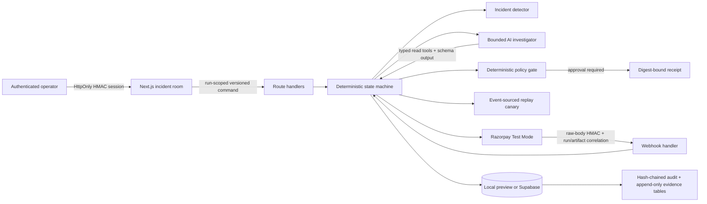

# RecoverOS architecture

## Control flow

## Trust boundaries

1. **Browser → server.** The browser holds only an HttpOnly, SameSite=Strict operator token. Every run endpoint revalidates the token and checks that the path run ID equals the token run ID.
2. **Model → policy.** Model output is untrusted. Zod validates shape and deterministic code validates supported playbooks, amount preservation, consent, frequency limits, approval thresholds, and stop-on-capture.
3. **Server → Razorpay.** A stable reference and request digest are persisted before the API call. Retries reconcile by reference before creating another Payment Link.
4. **Razorpay → webhook.** The handler verifies HMAC over the untouched raw request body. The signed payload must contain the run correlation and match the persisted provider ID, reference ID, and original amount before capture is accepted.
5. **Server → persistence.** Supabase uses optimistic version checks and transactions for state changes. Webhook event deduplication and the state transition occur in the same database function.

## State ownership

Each successful login creates a cryptographically random `run_<24 hex>` identifier embedded in the signed operator session. There is no shared demo run in the browser path. Local preview stores one file per run; Supabase stores one `recovery_runs` row per run. A run-scoped command from another session returns HTTP 403.

## Agent boundary

The investigator receives five typed, read-only tools and must return schema-valid investigation or promotion data. It does not receive Razorpay credentials or repository mutation tools. A deterministic fallback keeps the demo usable when OpenAI is absent or times out; the UI labels which path ran.

## Recovery execution

Canary assignment is seeded and persisted before fixture outcomes are read. Promotion replays an event-producing adapter that emits `intervention_dispatched`, `recovery_captured`, and `contact_stopped`. The ledger is reduced from those events, allowing duplicate-dispatch and post-capture-contact assertions instead of trusting fixed totals.

## Evidence semantics

- Fixture integrity is SHA-256 verification, not a digital signature.
- The incident score is a deterministic heuristic, not a calibrated probability.
- Local audit evidence is hash-chained and verified on read; it is tamper-evident, not storage-immutable.
- Supabase `audit_events` and `approval_receipts` reject update/delete operations, while snapshots remain mutable through version-checked service-role functions.
