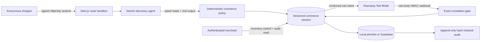

# Choosy architecture

## Control flow

## Responsibility split

- Gemini extracts multiple preferences from natural language and helps identify the next missing field. It has only typed, read-only tools.
- Deterministic code owns required-field completeness, catalog lookup, hard constraints, stock and price filtering, fit scoring, promotion tie-break disclosure, add-on limits, totals, quote integrity, and checkout eligibility.
- The catalog is merchant-scoped demo inventory. Unknown categories are honestly refused.
- Every mutation uses optimistic versioning and a persisted idempotency receipt.

## State machine

`discovering → recommendations_ready → item_selected → cart_review → checkout_ready → paid`

Safe branches are `agent_failure`, `needs_reselection`, and `payment_failed`. An unavailable variant moves the session to `needs_reselection` before any provider call. A late failure cannot regress `paid`.

## Trust boundaries

1. Shopper sessions use a signed, HttpOnly, SameSite=Lax cookie containing only the allowed shopping session ID.
2. Merchant APIs use a separate signed, HttpOnly operator cookie and merchant identity.
3. AI output is untrusted until strict schema and semantic validation pass; it never receives write or payment tools.
4. Payment intent is persisted before the Razorpay call and bound to cart/quote digests, reference, and amount.
5. Webhooks are verified from raw bytes, deduplicated by event ID, and exactly correlated before state changes.
6. Supabase transitions are version-checked; audit rows reject update and delete.

## Persistence

`004_choosy_agentic_commerce.sql` adds category profiles, catalog products and variants, commerce sessions, agent runs, checkout actions, webhook receipts, and audit events. Existing legacy tables are retained for rollback but are not read by the Choosy application.
